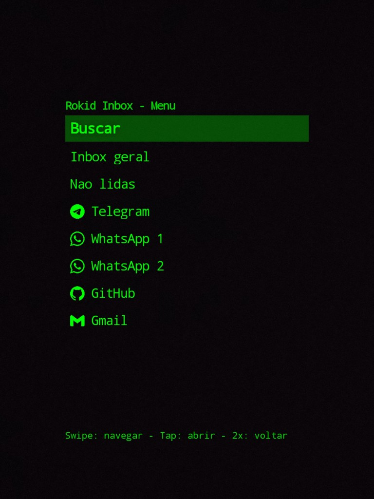
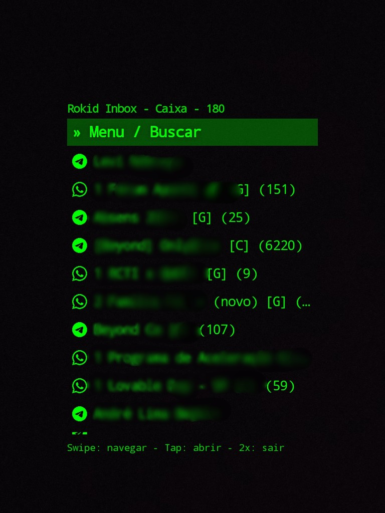
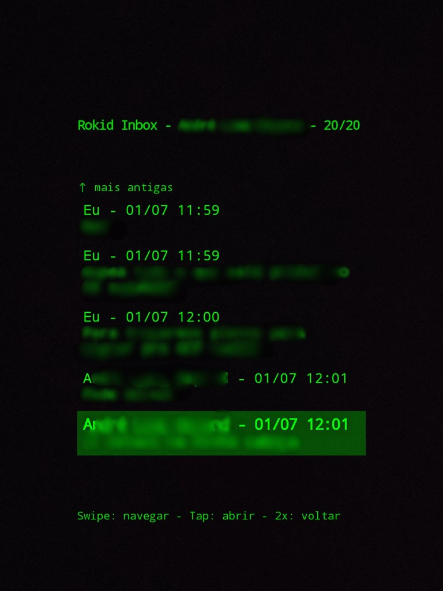
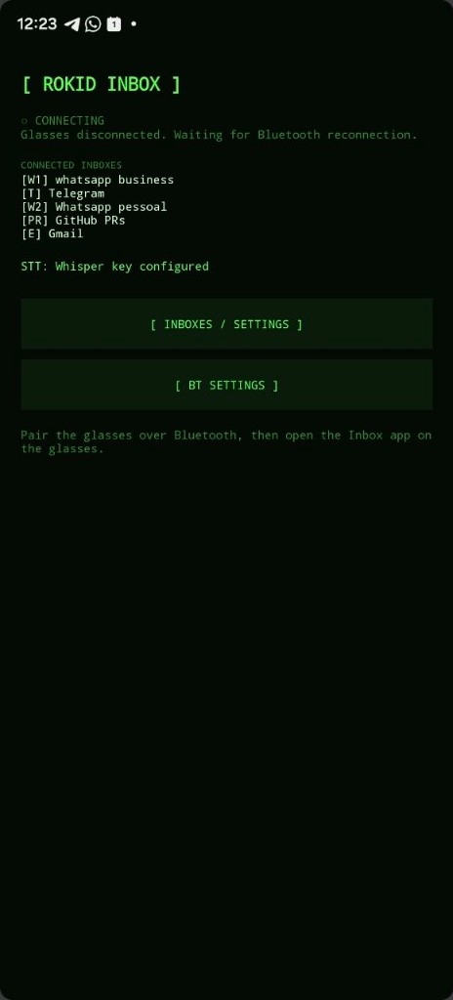
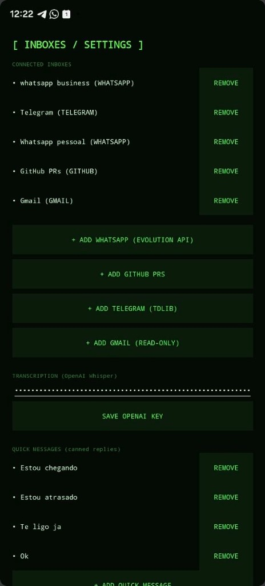

## Rokid Inbox

<p align="center">
  Multi-channel inbox on Rokid AR glasses, streamed live from your phone over Bluetooth.
</p>

<p align="center">
  <a href="LICENSE"></a>
  
  
</p>

## Screenshots

<p align="center">
  
  &nbsp;
  
  &nbsp;
  
</p>
<p align="center"><em>On the glasses — menu with channel logos · unified inbox · conversation (contacts blurred)</em></p>

<p align="center">
  
  &nbsp;&nbsp;
  
</p>
<p align="center"><em>On the phone — host status · inbox settings</em></p>

---

## What it is

Rokid Inbox is a unified inbox for Rokid AR glasses. The phone connects to
multiple message channels, and the glasses show a single merged inbox you can
browse, read, search by voice, and reply to hands-free — recording a voice note
that is transcribed on the phone so you can send the transcribed text or the
original audio.

You can also ask an **AI agent to describe an image or a file** (pdf, xlsx, docx,
csv, ...) directly from the glasses: open a photo or document message, pick
**Descrever (IA)**, and the phone uses OpenAI to return a detailed text summary on
the HUD. The same OpenAI key powers both voice transcription (Whisper) and these
AI descriptions.

Inspired by the Even Realities app [`byndcloud/even-inbox`](https://github.com/byndcloud/even-inbox),
rebuilt natively as a two-app system (Android phone host + glasses client) over a
Bluetooth transport with a versioned handshake and an amber-monospace HUD.

## Channels

Each channel has a step-by-step setup guide:

- **[WhatsApp](docs/channels/whatsapp.md)** — via your own Evolution API server (text, voice, reactions, photos).
- **[Telegram](docs/channels/telegram.md)** — via a self-hosted [GramJS](https://github.com/gram-js/gramjs) bridge over MTProto (text, voice, reactions, photos).
- **[Gmail](docs/channels/gmail.md)** — OAuth2, read-only (each thread is a chat).
- **[GitHub PRs](docs/channels/github.md)** — REST, read-only (each PR is a chat).

Multiple accounts ("boxes") of the same type are supported and labeled `[W]` / `[W1]` / `[W2]`.
Want another source? See [Adding a new channel](docs/developing/adding-a-channel.md).

## How it works

```text
Rokid Glasses (thin HUD client)                 Android Phone (host / brain)
  inbox / conversation / reply UI   <──CXR/BLE/SPP──>  channel services + STT
  mic capture (PCM) ───────────────── stream ───────►  Whisper transcription
```

- The **phone app** runs all channel integrations, the unified inbox aggregator,
  OpenAI Whisper transcription, OpenAI image/file descriptions, and the Bluetooth
  transport server. Credentials are stored on-device (EncryptedSharedPreferences);
  nothing leaves the phone except the calls each channel makes to its own API.
- The **glasses app** is a fullscreen HUD: browse the inbox, open a conversation,
  reply by voice (record → transcription preview → send text or audio) or with a
  canned quick message, and voice-search chats by name.

## Documentation

- [Architecture](docs/architecture.md) — how the phone, glasses, transport, and channels fit together.
- [Using the glasses](docs/usage-glasses.md) — HUD controls and the reply / react / search flows.
- Channel setup — [WhatsApp](docs/channels/whatsapp.md) · [Telegram](docs/channels/telegram.md) · [Gmail](docs/channels/gmail.md) · [GitHub PRs](docs/channels/github.md)
- [Adding a new channel](docs/developing/adding-a-channel.md) — developer guide.
- [Telegram bridge](telegram-bridge/README.md) — the self-hosted GramJS service.

## Project structure

```text
android-phone/       Phone host: settings + channel services + Whisper + transport server
android-glasses/     Glasses client: HUD + navigation + mic capture + transport client
shared-contracts/    Shared Bluetooth wire protocol + inbox data contracts
telegram-bridge/     Self-hosted GramJS (MTProto) HTTP bridge for Telegram
docs/                Architecture, usage, per-channel guides, and developer docs
```

## Build

There is no `gradlew` (Unix) checked in — only `gradlew.bat`. On macOS/Linux run
the pinned wrapper via its jar with JDK 17+ (21 works):

```bash
export JAVA_HOME="$(/usr/libexec/java_home -v 21)"
export ANDROID_HOME="$HOME/Library/Android/sdk"

# Phone APK
cd android-phone && "$JAVA_HOME/bin/java" -cp gradle/wrapper/gradle-wrapper.jar \
  org.gradle.wrapper.GradleWrapperMain assembleDebug --console=plain

# Glasses APK
cd ../android-glasses && "$JAVA_HOME/bin/java" -cp gradle/wrapper/gradle-wrapper.jar \
  org.gradle.wrapper.GradleWrapperMain assembleDebug --console=plain
```

Outputs: `android-phone/app/build/outputs/apk/debug/inbox-phone-debug.apk` and
`android-glasses/app/build/outputs/apk/debug/inbox-glasses-debug.apk`.

### Telegram (self-hosted bridge)

Telegram uses your own account over MTProto through a small [GramJS](https://github.com/gram-js/gramjs)
HTTP service in [`telegram-bridge/`](telegram-bridge/) that you host (for example
next to your Evolution API server). The phone app talks to it over HTTP with an
API key — no native library on the phone. Setup:
[`telegram-bridge/README.md`](telegram-bridge/README.md).

## Install / sideload

- **Phone**: `adb install -r android-phone/app/build/outputs/apk/debug/inbox-phone-debug.apk`
- **Glasses**: push the APK to phone storage and sideload it via the **Hi Rokid**
  app (there is no direct developer ADB to the glasses):
  ```bash
  adb push android-glasses/app/build/outputs/apk/debug/inbox-glasses-debug.apk /sdcard/Download/
  ```

## First run

1. Install the phone app and sideload the glasses app.
2. Pair the phone and glasses over Bluetooth at the OS level.
3. Open the phone app, grant Bluetooth/notification permissions, then open
   **[ INBOXES / SETTINGS ]** and add at least one channel (WhatsApp, GitHub,
   Gmail, or Telegram) and, optionally, your OpenAI key (used for voice
   transcription and AI image/file descriptions).
4. Open the Inbox app on the glasses. Browse the inbox, open a chat, and reply by
   voice (record → preview → send text/audio) or with a quick message.

## Release signing

Release builds read signing from env vars or Gradle properties:
`ANDROID_KEYSTORE_PATH`, `ANDROID_KEYSTORE_PASSWORD`, `ANDROID_KEY_ALIAS`,
`ANDROID_KEY_PASSWORD`, and optional `ROKID_INBOX_VERSION_NAME` /
`ROKID_INBOX_VERSION_CODE`. `assembleRelease` falls back to the debug keystore
when signing values are absent; partial configuration fails the build.

## License

Released under the [MIT License](LICENSE).
