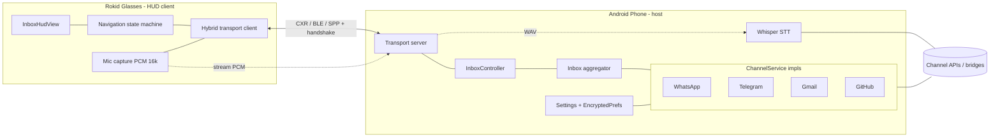

# Architecture

Rokid Inbox is a **two-app system** plus optional per-channel backends:

- **Phone app** (`android-phone/`, Kotlin) — the "brain". It connects to every
  message channel, aggregates a unified inbox, runs speech-to-text, stores your
  credentials on-device, and serves everything to the glasses over Bluetooth.
- **Glasses app** (`android-glasses/`, Kotlin) — a thin heads-up-display (HUD)
  client. It renders the inbox/conversations, captures your voice, and sends
  input back to the phone. It needs no internet of its own.
- **Shared contracts** (`shared-contracts/`) — the Bluetooth wire protocol and
  data model, compiled into both apps.
- **Per-channel backends** — some channels talk to a service you host: WhatsApp
  via [Evolution API](channels/whatsapp.md), Telegram via the bundled
  [GramJS bridge](channels/telegram.md). Gmail and GitHub call their public APIs
  directly from the phone.

## Phone components

- `InboxPhoneActivity` — host status screen (glasses link + connected inboxes).
- `InboxSettingsActivity` — add/remove inboxes and set the OpenAI key.
- `InboxPhoneService` — foreground service keeping the runtime alive.
- `InboxGraph` — wiring: config store, channel services, Whisper, controller, server.
- `InboxController` — handles every glasses request (inbox, chat, voice, send, react, media).
- `InboxConfigStore` — credentials in `EncryptedSharedPreferences`.
- `transport/InboxTransportServer` — Bluetooth SPP server + versioned handshake.
- `channels/*` — one `ChannelService` per integration + `InboxAggregator`.
- `voice/WhisperClient`, `voice/Wav` — PCM→WAV + OpenAI Whisper transcription.

## Glasses components

- `InboxGlassesActivity` — navigation state machine + input + mic capture.
- `InboxHudView` — amber-monospace rendering (lists, conversation, detail, image).
- `transport/HybridBridge` — races CXR / BLE / SPP, prefers whichever completes the handshake.
- `bluetooth/SppBridge`, `bluetooth/BleCentralBridge`, `cxr/CxrBridge` — transports.
- `audio/MicCapture` — `AudioRecord` PCM 16 kHz mono.

## Transport & wire protocol

The link is a **hybrid** of three transports (Bluetooth Classic SPP, BLE GATT,
Rokid CXR) that all speak the same JSON envelope: `{channel, type, payloadJson}`
(Gson). A **versioned handshake** (`Hello` → `HelloAck`, `PROTOCOL_VERSION`) runs
before any app data; BLE payloads are chunked/reassembled by `BleWireFramer`.

- `runtime` channel: `Hello`/`HelloAck`, `Status`, `Error`.
- `inbox` channel: everything else.

Glasses → phone: `RequestInbox`, `OpenChat`, `LoadOlder`, `MarkRead`, `SendText`,
`StartVoice`, `AudioChunk`, `EndVoice`, `ConfirmSend`, `CancelVoice`,
`RequestQuick`, `SendReaction`, `PlayAudio`, `RequestImage`.

Phone → glasses: `InboxSnapshot`, `ChatSnapshot`, `SearchResults`,
`Transcription`, `SendResult`, `QuickMessages`, `ActionResult`, `ImageResult`.

## Data model (`shared-contracts`)

- `ChannelKind` = `WHATSAPP | TELEGRAM | GMAIL | GITHUB`
- `Chat(channel, boxId, id, name, type, unreadCount, lastMessageDate, boxLabel)`
- `Message(id, text, media, date, isOutgoing, senderName, durationSec)`
  - `media` is a tag like `[photo]`, `[voice]`, `[audio]`, `[video]`, `[file]`.
- `ChatType` = `USER | GROUP | CHANNEL`

## Voice reply flow

1. On the glasses you pick **Responder → Voz**; `AudioRecord` captures PCM.
2. Chunks stream to the phone (`StartVoice` → `AudioChunk*` → `EndVoice`).
3. The phone assembles a WAV and calls OpenAI Whisper → `Transcription`.
4. The glasses show a preview: **send transcribed text** or **send original audio**.
5. `ConfirmSend` → the channel's `sendText`/`sendVoice` → `SendResult`.

Voice search works the same way but the transcription is used to filter chats by
name (`SearchResults`) instead of replying.

## More

- Operate the glasses UI: [usage-glasses.md](usage-glasses.md)
- Connect a channel: [channels/](channels/)
- Add your own channel: [developing/adding-a-channel.md](developing/adding-a-channel.md)
